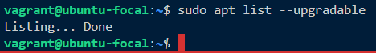
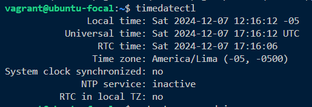
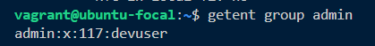
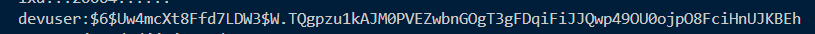

# Configuración básica del sistema

## Tareas

### Actualizar los paquetes del sistema

- Limpiamos el caché 
- Actualizamos los paquetes, tipo apt update apt upgrade

``` bash
sudo apt list --upgradable
```



###  Configurar la zona horaria y locales

- Configuración de zona America Latina con Hora Lima UTC - 5

``` bash
timedatectl
```



### Crear un grupo llamado admin
- Creación de usuario admin

``` bash
getent group admin
```



### Crear un usuario devuser pertenenciente al grupo admin con contra cifrada

- Asignación de devuser a admin con contraseña cifrada
``` bash
sudo cat /etc/shadow
```


